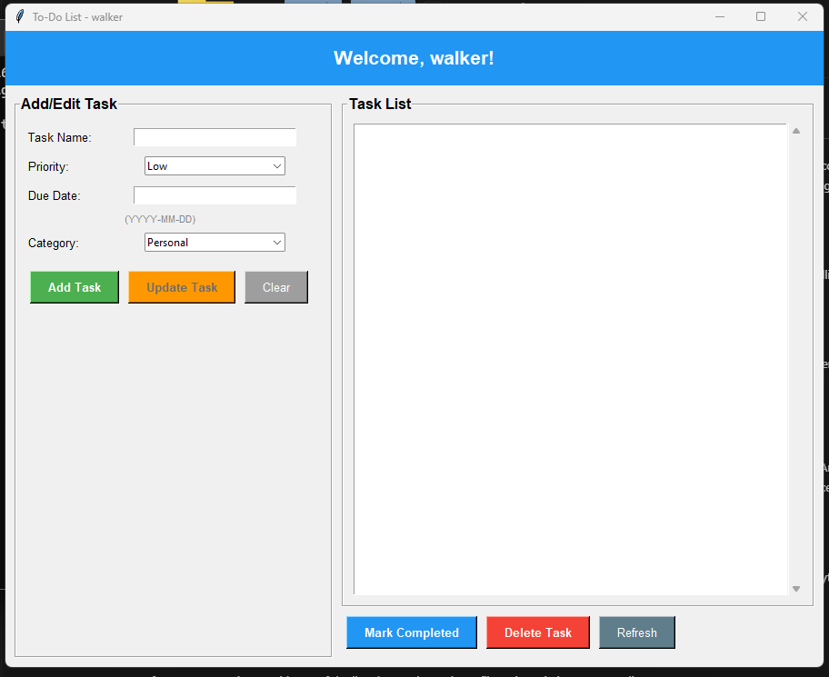
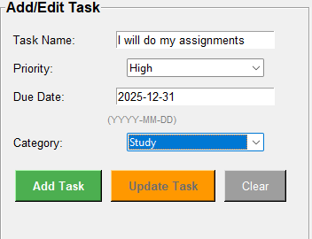
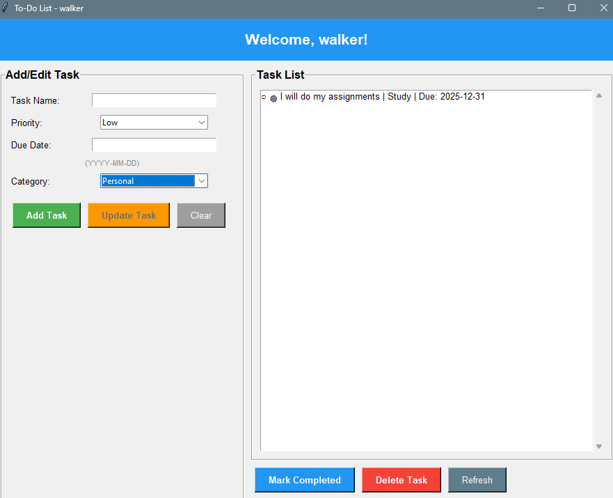

# To-Do List Management System

A comprehensive desktop application built with Python and Tkinter for managing your daily tasks efficiently.

## Features

### 🔐 User Login System
- Secure username and password authentication
- User registration for new accounts
- Password hashing for security (SHA-256)
- Each user has their own separate task storage
- Prevents unauthorized access to tasks

### ✅ Task Management
- **Add Tasks**: Create new tasks with:
  - Task Name
  - Priority (High/Low)
  - Due Date (YYYY-MM-DD format)
  - Category (Work, Personal, Study, Shopping, Health, Other)
  - Status (automatically set to "Pending")
  
- **View Tasks**: Display all tasks with complete details:
  - Task name
  - Priority indicator (🔴 High, 🟢 Low)
  - Due date
  - Category
  - Status (✓ Completed, ○ Pending)
  
- **Edit Tasks**: Update any task's:
  - Name
  - Priority
  - Due date
  - Category
  
- **Delete Tasks**: Remove unwanted tasks with confirmation
  
- **Mark Completed**: Mark tasks as completed with visual indicators

### 💾 Data Persistence
- Tasks are automatically saved to JSON files (`username_tasks.json`)
- Data is loaded automatically on application startup
- Each user's tasks are stored separately

## Screenshots

### Login/Register Window

*Login and registration interface with username and password fields*

### Main Application Window

*Main application interface showing task input form and task list*

### Task Management

*View of tasks with priority indicators, categories, and status markers*

### Task List View

*Complete task list with visual indicators for priority (🔴 High, 🟢 Low) and status (✓ Completed, ○ Pending)*

### How to Add Screenshots

1. Create a `screenshots` folder in the project root directory
2. Take screenshots of the application windows:
   - **login_window.png**: Login/Register window
   - **main_window.png**: Main application window with empty task list
   - **task_management.png**: Main window with tasks added
   - **task_list.png**: Task list showing various tasks with different priorities and statuses
3. Save the screenshots in the `screenshots` folder with the exact filenames shown above
4. The images will automatically display in this README

**Recommended Screenshot Sizes:**
- Width: 800-1200 pixels
- Format: PNG or JPG
- Keep file sizes reasonable (< 500KB each)

## Requirements

- Python 3.6 or higher
- Tkinter (usually included with Python)
- No additional packages required (uses only standard library)

## Installation

1. Clone or download this repository
2. Ensure Python 3.6+ is installed on your system
3. No additional dependencies needed!

## Usage

1. Run the application:
   ```bash
   python main.py
   ```

2. **Login/Register**: 
   - **New Users**: Enter username and password, then click "Register" to create an account
   - **Existing Users**: Enter your username and password, then click "Login"
   - Password must be at least 4 characters long

3. **Add a Task**:
   - Enter task name
   - Select priority (High/Low)
   - Enter due date (optional, format: YYYY-MM-DD)
   - Select category
   - Click "Add Task"

4. **View Tasks**: All tasks are displayed in the task list on the right side

5. **Edit a Task**:
   - Click on a task in the list
   - Modify the fields in the form
   - Click "Update Task"

6. **Mark Task as Completed**:
   - Select a task from the list
   - Click "Mark Completed"

7. **Delete a Task**:
   - Select a task from the list
   - Click "Delete Task"
   - Confirm the deletion

8. **Clear Form**: Click "Clear" to reset the input form

## File Structure

```
To-Do-Application/
├── main.py              # Main application file
├── README.md           # This file
├── SRS_Report.md       # Software Requirements Specification
├── screenshots/        # Application screenshots (optional)
│   ├── login_window.png
│   ├── main_window.png
│   ├── task_management.png
│   └── task_list.png
├── users.json          # User credentials storage (created automatically)
└── [username]_tasks.json  # User task storage (created automatically)
```

## Data Storage

### User Credentials
User accounts and passwords (hashed) are stored in `users.json`. Passwords are hashed using SHA-256 for security.

### Task Data
Tasks are stored in JSON format in files named `[username]_tasks.json`. Each file contains an array of task objects with the following structure:

```json
[
  {
    "name": "Task Name",
    "priority": "High",
    "due_date": "2024-12-20",
    "category": "Work",
    "status": "Pending"
  }
]
```

## Features Overview

### User Interface
- Clean, modern GUI built with Tkinter
- Color-coded buttons for different actions
- Visual indicators for task priority and status
- Scrollable task list for large numbers of tasks
- Responsive layout that adapts to window size

### Input Validation
- Task name is required
- Date format validation (YYYY-MM-DD)
- Prevents duplicate or invalid entries

### Error Handling
- User-friendly error messages
- Confirmation dialogs for destructive actions
- Graceful handling of file I/O errors

## System Architecture

- **LoginWindow**: Handles user authentication
- **TaskManager**: Manages task storage and retrieval (JSON-based)
- **Task**: Data model representing a single task
- **TodoApp**: Main application window with all UI components

## Future Enhancements (Optional)

- Search and filter functionality
- Task sorting options
- Export tasks to CSV/PDF
- Reminder notifications
- Task statistics and analytics
- Dark mode theme

## Troubleshooting

### Application won't start
- Ensure Python 3.6+ is installed
- Check that Tkinter is available (usually included with Python)

### Tasks not saving
- Check file permissions in the application directory
- Ensure sufficient disk space

### Date format errors
- Use the format: YYYY-MM-DD (e.g., 2024-12-20)
- Leave the field empty if no due date is needed

## License

This project is created for educational purposes.

## Author

To-Do List Management System - Python Project

---

**Note**: This is a standalone desktop application. All data is stored locally on your device.

